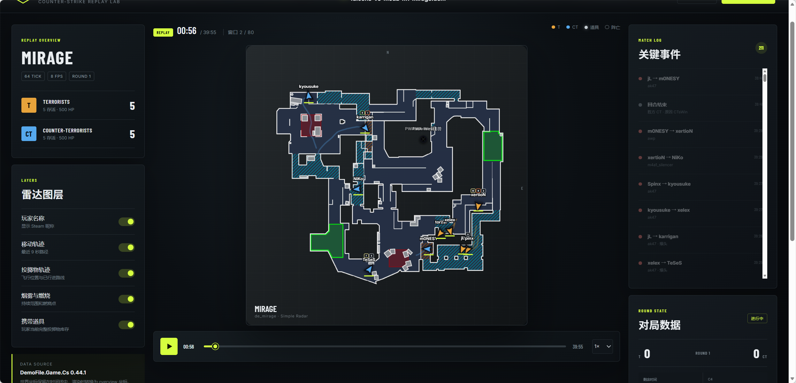

# CS Demo Map

读取 Counter-Strike 2 `.dem` 文件，在浏览器雷达中回放比赛状态，并导出数据训练当前回合的 T/CT 胜率基线。

## 当前能力

- 使用 `DemoFile.Game.Cs` 解析 CS2 CSTV/GOTV 与 POV demo。
- 默认每 8 tick 抽样一次（8 FPS），避免把完整 64 tick 实体状态直接塞进浏览器。
- 提取玩家坐标、速度、朝向、生命值、队伍、地图区域、当前武器和击杀/死亡数。
- 以 16 Hz 记录烟雾、闪光、手雷、燃烧弹和诱饵弹的飞行轨迹，并在前端插值播放。
- 按真实实体生命周期显示烟雾持续范围和燃烧区域。
- 仅在状态变化时记录每名玩家携带的全部投掷物，避免逐帧重复库存数据。
- 记录玩家金钱、护甲、头盔、拆弹器、装备价值、本回合花费，以及全部武器、弹药和道具。
- 每个玩家帧附带回合阶段、比分、回合计时、双方连败数，以及地图区域人数分布。
- 连续记录 C4 携带者、掉落/下包/已安放/拆除/爆炸状态、包点、坐标和倒计时。
- 提取回合开始/进入 live/结束、击杀、下包、拆包与爆炸事件。
- 结构化保存每回合开始、live、结束 tick、胜方阵营与结束原因。
- Vue + SVG 雷达支持播放、暂停、倍速、拖动时间线、玩家名字、移动轨迹和独立道具图层开关。
- 内置一段合成 Mirage 数据，无需 demo 和后端即可体验 UI。
- 地图坐标转换与雷达图层解耦；已接入 `cs-hud` 内含的 5 张 Simple Radar WebP。
- 大文件上传后进入单工作线程后台队列，解析结果按 30 秒窗口落盘并使用 Brotli 压缩。
- 浏览器只加载当前窗口、缓存最近 3 个窗口，并在播放到边界前预取下一窗口。

## 项目结构

```text
apps/
  api/                 ASP.NET Core API 与 demofile-net 解析适配层
  web/                 Vue 3 / TypeScript / Vite 雷达播放器
docs/
  architecture.md                    架构、边界与演进路线
  preliminary-training-report.md     6 场初训历史记录
  training-report-68-matches.md       最新固定验证摘要
  round-clock-upstream-review.md     上游接口与真实 Demo 核查
  data-semantics-v4-plan.md           待实施的数据语义迁移方案
tools/
  train_win_baseline.py               v3 训练与比赛级验证
  test_train_win_baseline.py          训练数据校验测试
```

## 当前状态（2026-08-31）

项目已具备 **Demo 回放与离线回合胜率训练管线**，尚未接入真实直播源、在线模型推理或前端胜率曲线。预测目标是当前回合 T 方是否获胜，不是整张地图或系列赛的胜负。

| 能力 | 当前状态 |
|---|---|
| Demo 解析与雷达回放 | 已实现；后端完整解析后生成按需加载窗口 |
| 训练数据与模型 | 本地 schema v3，68 场 Mirage、1,467 回合、128,441 条样本 |
| 比赛级验证 | 63 场训练、5 场验证；逻辑回归 Log Loss 0.4810、Brier 0.1627、AUC 0.8406 |
| 概率校准 | 已输出校准分箱评估，尚未拟合校准器 |
| 实时预测 | 待实现实时输入、增量状态与特征、推理接口及页面展示 |

### 文档导航

- [架构与当前边界](docs/architecture.md)
- [68 场 Mirage 固定验证摘要](docs/training-report-68-matches.md)
- [6 场初训历史报告](docs/preliminary-training-report.md)
- [回合与时钟上游接口核查](docs/round-clock-upstream-review.md)
- [v4 数据语义修正与迁移方案](docs/data-semantics-v4-plan.md)

**保留现有 v3 数据和模型，不直接覆盖。** v4 将使用独立版本和输出目录；当前 CLI 仍只导出／训练 v3，不能仅修改输出文件名就得到 v4。

## Demo 演示

下图展示了 Mirage 回放界面：中央雷达呈现玩家位置、移动轨迹与投掷物状态，左右面板同步展示比分、关键事件和回合数据。



## 环境要求

- Node.js 20+
- .NET SDK 10.0+（注意：仅安装 .NET Runtime 不能编译后端）

## 启动

```bash
npm install
dotnet restore apps/api/CsDemoMap.Api.csproj
npm run dev
```

打开 `http://localhost:5173`。前端会把 `/api` 代理到 `http://localhost:5088`。

如果暂时没有 .NET SDK，可以只启动内置示例：

```bash
npm install
npm run dev:web
```

## 导入 demo

页面右上角选择 `.dem` 文件后，浏览器会依次调用：

```http
POST /api/demos/import
Content-Type: multipart/form-data
file=<demo file>

GET /api/demos/{id}/status
GET /api/demos/{id}/windows/{index}
```

上传完成后 API 返回 `202 Accepted`，页面会显示排队、解析、生成窗口和载入首屏等阶段。解析完成前仍可保留在示例数据界面；完成后只解压当前时间附近的数据，不再一次传输并反序列化整场 JSON。窗口带有前后 2 秒重叠，跨边界时玩家轨迹、投掷物、持续效果、经济和装备状态不会断层。

### 从本地目录离线导入

API 默认扫描仓库根目录的 `data/mirage`，无需把数百 MB 的 Demo 再通过 HTTP 上传：

```http
GET /api/demos/offline

POST /api/demos/offline/import
Content-Type: application/json

{"fileName":"furia-vs-pain-m1-mirage.dem"}
```

导入成功返回 `202 Accepted`，之后继续使用同一组状态和窗口接口：

```http
GET /api/demos/{id}/status
GET /api/demos/{id}/windows/{index}
```

离线接口只接受配置目录顶层的纯文件名和 `.dem` 扩展名，不允许绝对路径、子目录、`..`、符号链接或目录联接。后台解析直接读取原文件，不复制也不删除它。若需要更换目录，可在启动 API 前设置：

```powershell
$env:OfflineDemos__RootPath = "D:\other\demo-directory"
dotnet run --project apps/api/CsDemoMap.Api.csproj
```

前端 API 客户端提供 `listOfflineDemos()` 和 `importOfflineDemo(fileName)`；当前页面仍保留原有上传入口，可在后续加入目录文件选择 UI。

当前任务队列和 manifest 保存在进程内，服务重启后不能继续旧任务；生成的窗口也尚未按 TTL 自动清理。后端解析阶段仍会在内存中构建整场 `DemoTimeline`，这些是下一轮持久化与流式解析需要处理的边界。

当前单个上传文件上限为 1 GiB。也可以跳过浏览器上传，直接在命令行解析并输出摘要：

```powershell
dotnet run --project apps/api/CsDemoMap.Api.csproj --no-restore -- --inspect-demo "D:\path\match.dem"
```

## 导出胜率训练数据

可以对单个 `.dem` 或包含 demo 的目录递归导出 JSONL：

```powershell
dotnet run --project apps/api/CsDemoMap.Api.csproj --no-restore -c Release -- `
  --export-win-data "D:\demos" "D:\datasets\cs2-win-v3.jsonl"
```

导出器仅采样正式回合的 live 与 post-plant 阶段，每秒生成一条记录。标签是 T 方是否赢得当前回合；输入只使用当前 tick 可见的玩家、回合、C4、区域和最近装备状态，不输出玩家姓名、Steam ID 或 C4 携带者 ID。每回合所有记录的 `sampleWeight` 之和为 1，避免长回合在训练时获得更高权重。

Schema v3 在因果 C4 状态变化、归一化队伍站位分散度、双方最近距离和到 A/B 包点的平均/最短距离基础上，新增比分/连败差、C4 计时器可用性、队伍空间缺失标记、最接近包点距离、包点接近度差、金钱/护甲/投掷物/主副狙与拆包器差、总存活人数、平均存活血量、残局标记和装备解析覆盖率。资源与队伍差均按 `T - CT` 计算；包点接近度差按 `CT 距离 - T 距离` 计算，正值表示 T 方更接近该包点。距离以 1024 像素雷达宽度归一化。当前包点几何覆盖 Mirage；其他地图的空间聚合值为 `null`，需要增加对应的版本化地图配置后再用于跨地图训练。
输出文件已存在时命令会直接报错，不会覆盖。CLI 逐场解析并逐行写出，但为生成稳定 `matchId` 会先读取一次 demo 计算 SHA-256。

这里的“正式回合”是当前导出器的筛选结果；2026-08-31 核查已发现额外回合开始事件可能造成编号漂移，`elapsedSeconds` 也包含冻结等待。v3 保留用于复现，修正范围与验收标准见 [v4 迁移方案](docs/data-semantics-v4-plan.md)。


## 训练基线胜率模型

训练工具要求 Python 3.11 或更高版本。安装固定版本依赖后，可以传入一个或多个 schema v3 JSONL：

```powershell
python -m pip install -r requirements-train.txt
python tools/train_win_baseline.py `
  --input "datasets\mirage-68-local-v3.jsonl" `
  --output-dir "models\win-baseline-v3-new-run"
```

数据和模型不随仓库分发；以上输入路径指本地已导出的数据。每次训练请使用新的输出目录：当前训练脚本会写入同名工件，**不要将 `--output-dir` 指向需要保留的历史模型目录**。

也可以重复传入 `--validation-match-id`，将指定比赛完整保留为固定验证集：

```powershell
python tools/train_win_baseline.py `
  --input "datasets\mirage-v3.jsonl" `
  --output-dir "models\win-baseline-v3-holdout" `
  --validation-match-id "<match-id-1>" `
  --validation-match-id "<match-id-2>"
```

CLI 会先验证 schema、重复样本、回合内标签一致性，以及每回合样本权重之和。未指定固定验证集时评估采用留一比赛交叉验证；指定后，两个模型及最终保存的模型都只拟合非验证比赛，并仅在完整保留的比赛上计算指标。两种模式都不会把同一个 `matchId` 的相邻时刻分到训练和测试两侧。输入特征排除了 `matchId`、tick、Demo 绝对时间、玩家身份、完整玩家数组和最终胜负标签。

输出目录包含：

- `baseline.joblib`：当前正式选定的逻辑回归基线模型，供后续推理接口统一加载。
- `logistic.joblib`：同一逻辑回归模型的具名工件。
- `lightgbm.joblib`：保留用于比较的 LightGBM 挑战模型，不作为当前默认基线。
- `report.json` 和 `report.md`：评估协议、总体/逐场指标、校准分箱与特征重要性。
- `oof_predictions.jsonl`：每个样本的严格样本外预测，可用于复核和绘制校准曲线。
- `validation_predictions.jsonl`：使用固定验证集时生成，只包含保留比赛的预测。

当前代码通过 `SELECTED_BASELINE = "logistic"` 固定默认模型，并未实现每次训练自动择优；报告记录其实际验证 Log Loss。本次 68 场实验中逻辑回归也优于 LightGBM。报告的选择指标说明不应理解为自动发布或切换模型。

`models/` 和 `datasets/` 默认不提交到 Git，避免误传训练数据和二进制模型。少量比赛只能验证训练管线；需要更多独立比赛后，才能将这些指标作为泛化性能依据。

最新的 68 场固定比赛验证见 [验证摘要](docs/training-report-68-matches.md)。[6 场初训报告](docs/preliminary-training-report.md) 作为历史记录保留，两次实验切分协议不同，不能直接用分数差声称性能提升。

## 地图资源

`apps/web/public/radars/simpleradar` 直接复制了 `cs-hud` 的 Simple Radar 子目录，包含 Cache、Dust II、Mirage、Nuke 上层和 Nuke 下层。对应的 `pos_x`、`pos_y`、`scale` 也来自其 `radars.json`。其他地图仍使用抽象 SVG 回退图。

这些图片由 `cs-hud` 标注为 TL;DR 的 CS:GO 版 Simple Radar，并非 `cs-hud` 作者原创。来源、文件哈希和再分发提示见 [THIRD_PARTY_NOTICES.md](THIRD_PARTY_NOTICES.md)。

## 验证

```bash
npm run typecheck
npm test
npm run build
dotnet build apps/api/CsDemoMap.Api.csproj
# 安装 requirements-train.txt 后执行训练工具测试
npm run test:train
```

现有后端数据管线检查主要使用合成时间线。上游核查中的三场 Demo 诊断是独立研究验证，尚未纳入自动回归测试；硬暂停、技术暂停恢复等场景仍需补充样本。

## 参考与许可证

- [drweissbrot/cs-hud](https://github.com/drweissbrot/cs-hud) — 主仓库为 ISC；参考其状态分层、阶段和倒计时设计。项目已复制其目录中的第三方 Simple Radar 图片，来源及授权边界见 [第三方声明](THIRD_PARTY_NOTICES.md)，不能将图片默认视为 ISC 授权。
- [saul/demofile-net](https://github.com/saul/demofile-net) — MIT；通过 NuGet 包 `DemoFile.Game.Cs` 使用。
