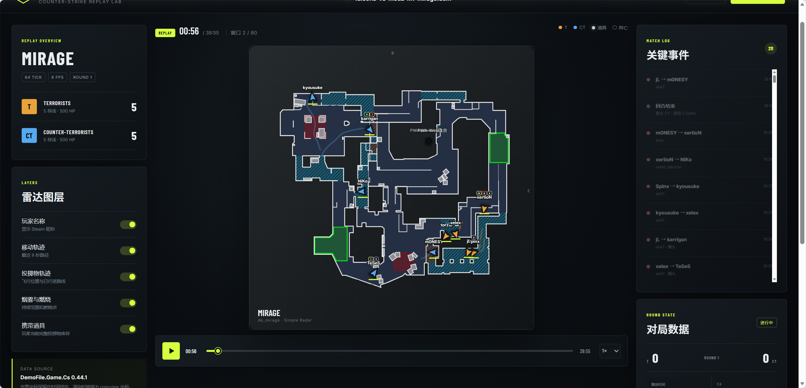

# CS Demo Map

[English](README.md) | 简体中文

CS Demo Map 用于导入 Counter-Strike 2 .dem 文件，在交互式雷达中回放比赛，并显示当前回合 T/CT 的实时胜率。预测目标是当前回合胜方，不是整张地图或整场系列赛的胜负。

## 已实现能力

- 通过 DemoFile.Game.Cs 解析 CS2 CSTV/GOTV 与 POV Demo。
- 以 8 Hz 记录玩家位置、速度、朝向、血量、武器、经济、装备、道具库存、回合状态、C4、比分、连败数和区域人数。
- 以 16 Hz 记录投掷物轨迹，并按真实生命周期显示烟雾和燃烧区域。
- 基于 Vue 3 与 SVG 的回放界面，支持播放、拖动、倍速、玩家名称、轨迹、投掷物、效果和库存图层。
- 以带两秒重叠的 30 秒 Brotli 压缩窗口传输时间线；浏览器只加载当前窗口、维持小型缓存并预取下一窗口。
- 使用 schema v4.2 Mirage 模型，在 live 与下包后阶段约每秒生成一次回合胜率。
- 页面实时胜率卡片只会在同一回合 segment、同一阶段内插值；冻结、回合结束、跨阶段和过期数据都会清空旧胜率。

仓库还包含合成 Mirage 时间线，因此无需 Demo 文件或 API 也能体验前端界面。

## 架构

~~~text
.dem
  -> DemoFile.Game.Cs
  -> DemoParserService
  -> WinFeatureSampleBuilder
  -> WinInferenceClient（由 API 托管的 Python 进程）
  -> WinTimelinePredictionService
  -> DemoImportService（Brotli 窗口文件）
  -> Vue 回放界面与实时胜率卡片
~~~

API 管理一个长期运行的 Python 推理子进程。启动时会校验模型清单、工件哈希、依赖契约和固定推理样例。模型无法加载时，Demo 回放仍可使用，页面会明确显示预测不可用。

## 环境要求

- Node.js 20+
- .NET SDK 10.0+
- Python 3 与 pip，用于模型推理
- 需要真实预测时，准备本地 schema v4.2 模型包

默认模型目录为 models/win-baseline-v4-holdout-87-8-20260908。模型包、数据集和 Demo 文件均被 Git 忽略。

## 快速启动

~~~bash
npm install
dotnet restore apps/api/CsDemoMap.Api.csproj
python -m pip install -r requirements-inference.txt
npm run dev
~~~

打开 http://localhost:5173。前端会将 API 请求代理到 http://localhost:5088。npm run dev 会同时启动 API、前端和由 API 管理的 Python 推理进程。

若只想查看合成回放：

~~~bash
npm install
npm run dev:web
~~~

### 推理配置

启动前可以通过环境变量覆盖默认配置：

~~~powershell
$env:WinInference__PythonExecutable = "python"
$env:WinInference__ModelDirectory = "models/win-baseline-v4-holdout-87-8-20260908"
npm run dev
~~~

使用以下接口检查模型状态：

~~~http
GET /api/win-model/status
~~~

模型就绪时，响应会提供 schema、语义版本、模型、校准方式、工件哈希和 Python 运行时。模型缺失、不兼容或被禁用时，接口会返回 unavailable 或 disabled 与错误原因；Demo 仍可继续导入和回放。

## 导入 Demo

在网页右上角选择 .dem 文件：

~~~http
POST /api/demos/import
Content-Type: multipart/form-data
file=<demo file>

GET /api/demos/{id}/status
GET /api/demos/{id}/windows/{index}
~~~

界面会显示上传、排队、解析、计算胜率、生成窗口和载入首屏等状态。每次完成的导入包含：

- manifest.winPrediction：模型状态、schema/语义版本、模型、校准、工件哈希、样本数、采样间隔，以及不可用时的错误。
- windows[].winPredictions[]：tick、Demo 时间、回合身份、segment、正式回合号、阶段、T 方概率和 CT 方概率。

页面只在 live 与下包后阶段显示胜率；仅在同一回合 segment 和同一阶段的相邻样本间插值。冻结、结束、跨阶段或样本过期时会清空卡片。

### 离线导入

API 可直接导入 data/mirage 目录中已有的文件，避免再次上传数百 MB 的 Demo：

~~~http
GET /api/demos/offline

POST /api/demos/offline/import
Content-Type: application/json

{"fileName":"furia-vs-pain-m1-mirage.dem"}
~~~

离线接口只接受顶层 .dem 文件名。使用其他目录时：

~~~powershell
$env:OfflineDemos__RootPath = "D:\other\demo-directory"
dotnet run --project apps/api/CsDemoMap.Api.csproj
~~~

## 数据与模型流程

v4.2 流程仅使用 live 与下包后阶段、当前 tick 已知的因果特征。特征不包含玩家身份、未来事件、回合最终状态或目标标签。

训练前安装固定依赖：

~~~bash
python -m pip install -r requirements-train.txt
~~~

~~~powershell
dotnet apps/api/bin/Release/net10.0/CsDemoMap.Api.dll --export-win-data-v4 data/mirage datasets/mirage-v4-20260908-87
python tools/audit_win_v4.py --v3 datasets/mirage-68-local-v3.jsonl --v4-dir datasets/mirage-v4-20260908-87 --output datasets/mirage-v4-20260908-87/comparison.json
python tools/train_win_baseline_v4.py --input datasets/mirage-v4-20260908-87/samples.jsonl --manifest datasets/mirage-v4-20260908-87/manifest.json --comparison datasets/mirage-v4-20260908-87/comparison.json --validation-split datasets/mirage-v4-20260908-87/validation-split-87-8-seed42.json --output-dir models/win-baseline-v4-holdout-87-8-20260908 --threads 4 --folds 5 --seed 42
~~~

每次导出和训练都应使用新的输出目录。历史 v3 数据与模型仅用于复现，不能与 v4 输入或模型包混用。

## 验证

~~~bash
npm run typecheck
npm test
npm run test:inference
npm run test:inference:dotnet
npm run test:audit
npm run test:train
npm run test:train:v4
npm run build
~~~

最新端到端验收导入了 furia-vs-pain-m1-mirage.dem：回放时长 2,124.92 秒，生成 71 个窗口和 1,282 个胜率点。页面在 live、下包后和窗口边界附近均与 API 匹配；冻结阶段会清空概率；禁用推理时会显示不可用状态。

## 文档

- [架构与运行边界](docs/architecture.md)
- [schema v4.2 实现说明](docs/semantic-v4-implementation.md)
- [语义验收](docs/semantic-v4-validation.md)
- [最新 87 场 v4.2 训练报告](docs/training-report-v4-87-matches.md)
- [v4 重训报告](docs/training-report-v4.md)
- [68 场历史验证摘要](docs/training-report-68-matches.md)
- [回合与时钟接口核查](docs/round-clock-upstream-review.md)
- [第三方声明](THIRD_PARTY_NOTICES.md)

## 当前限制

- 任务与 manifest 保存在进程内，重启 API 后正在进行的导入失效。
- 解析器仍会先构建完整 DemoTimeline 再分割窗口，峰值内存尚未实现真正流式化。
- 当前模型和地图几何仅面向 Mirage。
- 真实直播输入、任务持久化、TTL 清理、多实例协作和更多地图仍待实现。

## 致谢与许可证说明

- Demo 解析使用 [demofile-net](https://github.com/saul/demofile-net)，许可证为 MIT。
- apps/web/public/radars/simpleradar 中的 Simple Radar 资源来自 [cs-hud](https://github.com/drweissbrot/cs-hud)。来源与再分发说明见 [THIRD_PARTY_NOTICES.md](THIRD_PARTY_NOTICES.md)。
