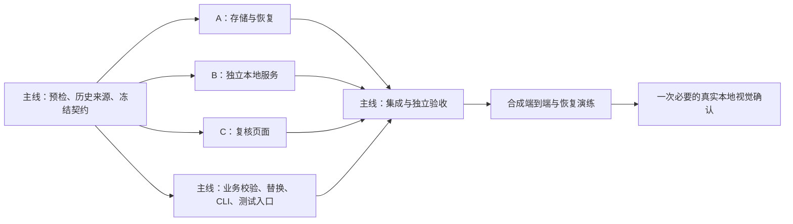

# 阶段四步骤八：子智能体并发实现方案

日期：2026-09-19。状态：已按用户指定模型配置实施；实际交付与测试见 [步骤八验收报告](stage4-review-tool-report-20260919.md)。下文保留执行设计，不以估时或计划替代验收证据。

依据：根 `TODO.md` 的阶段四人工复核要求、`TODO_4.md` 第 9 节及相关的第 8、10、12 节。这里的步骤八是本地复核工具，不是总 TODO 的阶段八产品前端。现有步骤七候选已技术 complete，文档仍记录等待用户审核；本方案不将其视为已获人工批准。

## 1. 可行性与现场证据

建议采用 **1 名主智能体 + 3 名子智能体**。存储、独立 HTTP 服务、静态页面可以在统一契约后并行；历史来源兼容、共享契约、CLI 和最终集成由主智能体负责。

已阅读项目规则、当前上下文、步骤七报告和相关源码；本次只重新计算以下三个文件的 SHA-256，没有重跑全量语义验收：

| 对象 | 目录/文件 | 本次实测 SHA-256 |
| --- | --- | --- |
| 基础 manifest | `datasets/situation-stage4-full-20260919-r1/manifest.json` | `e60e8bf001ea55b1932fba7bed83468ee104cac8516525fe539409edaae8a3f9` |
| 候选 manifest | `datasets/situation-stage4-review-candidates-20260919-r1/manifest.json` | `9e0e1b4f58321041c208f5d6be716242f7340bef362a6ef43f407b929c8325f4` |
| 候选 JSONL | 同候选目录的 `review-candidates.jsonl` | `3588795dbd713cb9ff684b59776539c74c540a89641fb61883efe8d3a42565c7` |

三项与步骤七报告相符。报告记录 220/40/40 候选、全部 87 场覆盖、配额无短缺。以下可直接复用：

- `SituationReviewDecisionV1`、四项评价及既有 decision Schema。
- `SituationTrainingContractJson.Validate(decision, candidate)`、规范化哈希和 Narrative/evidence 校验。
- 步骤七轻量来源池、后备顺序与替换约束逻辑。
- 已归一化的 `candidate.Input.Scene`；无需重新解析 Demo 或加载模型。

需要补齐的实际缺口：

1. TODO 的 serve 命令只有基础目录和 work 目录，但候选现在是独立工件，必须显式绑定候选目录。
2. `SituationReviewCandidateProvenance.VerifyAsync` 比较当前 Git 状态及动态枚举的所有 Situation 源码/Schema；增加文件或修改 CLI 即可能使历史候选验证失败。不能直接把它当作长期消费接口。
3. `SituationArtifactIO.WriteTextAtomicAsync` 使用固定 `path + ".tmp"`，没有步骤八要求的唯一临时文件、显式持久化 flush、并发 revision 控制和写后语义回读。
4. 既有 decision 校验器检查结构与关联，但没有完整工作流门禁：例如 blocked 状态不能算有效批准、拒绝备注必填、工作区阻断与重复提交。这些应在新服务层补齐。
5. 当前步骤五至七存在大量未提交及未跟踪源码。并行任务必须基于当前工作区，不能从 HEAD 新建空工作树后误以为包含这些成果。

## 2. 交付范围

交付独立 CLI 复核工具：本地匿名雷达、事实与证据、Narrative 编辑、四项评价、筛选导航、revision 冲突、原子保存、恢复、拒绝及替换审计、定向测试和运行说明。

真实 300 条由人复核；技术测试不代填人工评价。步骤九的 freezer、最终标签文件和冻结 `reviewVersion` 留待后续。基础和候选目录保持只读，所有可变状态在新的 work 目录。

不修改生产 Web 或产品 API，不训练模型，不修改冻结规则、切分、scene/Facts/Narrative 契约。实现前核对步骤七用户审核状态；合成数据开发与测试不依赖人工标签已完成。实际投入正式复核时记录使用的已批准候选哈希。

## 3. 主智能体先固定的协议

### 3.1 CLI 与工作区身份

建议在 TODO 原参数基础上增加一个必填具名参数，避免默默猜测兄弟目录：

```text
--serve-situation-review <dataset-directory> <review-work-directory>
  --candidates <review-candidate-directory> [--port <port>]
```

这是待实施的 CLI 细化，不是当前已有命令。主线统一更新 TODO 与 RUNBOOK 中的命令。默认绑定 `127.0.0.1:0`，由系统选择空闲端口并显示实际 URL；显式端口冲突立即失败，绝不终止已有进程。

`workspace.json` 使用独立版本，绑定基础 manifest、候选 manifest、候选 JSONL、split、策略和必要 Schema 哈希，记录草案 review ID。重开必须逐项匹配，不能只验证 dataset hash。拒绝 work 与输入目录相同、嵌套或通过重解析点指向受保护输入。

只允许服务启动时接收本地路径；浏览器只能使用白名单 sampleId、筛选枚举、revision 和决定载荷。新建 work 要求目录不存在，恢复已有目录必须显式验证身份并获取独占进程锁。

### 3.2 历史工件消费

主线新增 `SituationReviewArtifactLoader`，保持既有生产期验证器的严格行为：

1. 修改源码前，运行一次必要的步骤七只读验证，记录实际命令、输入哈希和结果；对 provenance 已列出的生产文件生成受哈希约束的本地快照及清单，放入新的诊断目录，不进入公开工件。
2. 新 loader 固定绑定本方案所列基础/候选 manifest 及历史 provenance，验证文件清单、大小、行数、Schema、策略、后备来源及 300 条与基础记录的关联；不以版本字符串或 Git HEAD 替代内容哈希。
3. 历史生产来源按原清单和快照验证；当前 review 消费者另记独立来源清单。当前 Git HEAD、dirty 或新增消费者文件不应成为拒绝旧候选的唯一原因。
4. 明确测试：消费者升级可读；候选、规则、Schema、split、源记录或快照篡改必须拒绝。不得添加通用的“跳过所有来源验证”开关。
5. 300 条载荷可驻留内存；约 35.8 MB manifest 和后备索引留在服务器。浏览器仅取得列表摘要和当前样本。基础约 1.1 GB JSONL 只在启动验证或受控后备载荷读取时扫描，不能在每次翻页/保存时重扫。

### 3.3 共享类型与接口

主线拥有 `Review/Contracts/*` 及新 work/transaction Schema。旧 decision v1 不增加字段；协议额外信息放在传输 DTO 或独立事务信封。

| 接口 | 输入/输出及关键语义 |
| --- | --- |
| `IReviewCatalog` | 已验证候选、按 sampleId 取值、来源身份、稳定 ordinal、冻结类别与后备索引；不向浏览器暴露路径 |
| `IReviewDecisionService` | 校验四项评价、决定、阻断、Narrative 和引用；产出待保存 decision，由主线实现 |
| `IReviewWorkStore` | 恢复、读取、保存；输入 expected revision、requestId 和已校验决定；返回新 revision/decision hash 或稳定冲突码 |
| `IReviewReplacementService` | 对已拒绝非阻断样本计算首个合法后备；绑定 workspace revision；由主线实现 |
| `ReviewSaveRequest` | sampleId、expectedRevision、requestId、decision、evaluations、issueFields/codes、note、可选 editedNarrative |
| `ReviewSaveResponse` | sampleId、sampleRevision、decisionSha256、workspaceRevision、分 split 进度、blocking 状态 |

冻结语义：未保存 revision 为 0，首次成功保存为 1；后续加 1。状态值沿用 `approved | modified | rejected`。服务端生成时间、权威哈希和 blocking 标志，客户端不得自行声明可信。

建议接口：`GET /review/session`、`GET /review/samples`、`GET /review/samples/{id}`、`POST /review/validate`、`POST /review/decisions`、`POST /review/replacements`。全部只属于独立工具宿主。列表使用稳定 ordinal；过滤后没有项时显示空态，不回退到其他 split。

稳定错误至少包括：`invalid-request`、`unknown-sample`、`origin-denied`、`token-invalid`、`revision-conflict`、`workspace-conflict`、`narrative-invalid`、`blocking-issue`、`storage-failed`、`artifact-mismatch`、`no-valid-replacement`。HTTP 映射由主线一次确定，B/C 不分别发明。

### 3.4 决定与阻断语义

- 四项评价初始均未选择，不能用默认 false 冒充人工回答。
- approved 的 `finalNarrative=null`，final hash 等于 candidate hash；modified 必须与原候选不同，且通过关联候选的校验器。禁止只用单参数 decision 校验器验证 evidence。
- rejected 必须有稳定 reason code 和非空短备注；不增加有效完成数。
- `factsCorrect=false` 或身份/未来信息/未知 evidence 报告触发 blocking。允许持久化合法的阻断报告，不能把它作为 approved/modified 的有效标签，也不能用替换绕过。
- 未知 evidence 的非法编辑稿不能保存为有效 Narrative；页面可另行提交不含非法最终文本的阻断报告。前端实时校验和服务端最终校验须使用相同规则结果。
- blocking 在工作区持续可见，阻止继续批准、替换和未来冻结；可继续查看与记录问题。不能通过下一次修改评价静默清除上游问题，解决须回到上游修复及新的工件身份。
- 当前有效进度按 active 集中 approved/modified 且无 blocking 的样本统计；操作数、rejected 数、未复核数和各 split 有效数分别显示。

### 3.5 原子保存、重试与替换

单样本决定以 `decisions/<sampleId>.json` 为权威，`index.json` 可重建。A 新建专用 writer，复用公共哈希/序列化工具，不直接修改历史通用 writer。

保存流程：进程独占 work 锁 → 锁内检查 revision 与幂等请求 → 完整校验 → 同目录唯一 tmp → 文件 flush（持久化 flush）→ 原子替换目标 → 从目标回读并校验 JSON/hash/Narrative/evidence → 返回成功。索引更新失败不撤销已确认的决定，重启重建。

需要处理响应丢失：同 requestId/同载荷返回原成功结果；同 requestId/不同载荷拒绝；不同请求的旧 revision 返回冲突。requestId 和请求摘要保存在独立可恢复事务/回执中，不能修改冻结的 decision v1 形状。

多个文件之间不声称具备文件系统原子性。主线与 A 在开工前固定事务协议：先持久化意图及目标哈希，保存决定和审计，再发布提交标记；崩溃恢复时在对外服务前完成可证明的重放或报告冲突。损坏或歧义不得自动丢弃已确认记录；残留 tmp 不直接晋升为已批准决定。每个提交点前后都需故障注入。

拒绝和替换分为两个操作：先可靠保存 reject，再由用户触发替换。主线用冻结后备顺序取同 split/同优先类别首个满足比赛、回合、唯一性与覆盖约束的后备；不让浏览器任意指定新样本。后备仍为 unreviewed，继承被替换项的展示 ordinal，不自动产生标签。

替换持久化包含 old/new sampleId、拒绝 decision hash、后备顺序依据、约束结果和 workspace revision；保留被拒记录与替换链。A 的事务机制保证 active-set 与 audit 一致，二者从已提交替换事务重建。未来步骤九才能据此冻结 220/40/40 标签。若该恢复协议未通过测试，工具不得用于真实复核。

## 4. 子智能体分工与文件所有权

实际目录采用已重构的 `Features/Situation` 和 `apps/cli`，不照搬 TODO 第 11 节旧的 `Services/*` 路径。

| 角色 | 独占文件范围（拟新增） | 交付与验收重点 |
| --- | --- | --- |
| 主智能体 | `apps/api/Features/Situation/Review/Contracts/*`、`SituationReviewArtifactLoader.cs`、`SituationReviewDecisionService.cs`、`SituationReviewReplacementService.cs`；新 Schema；CLI、csproj、package、测试入口与文档 | 冻结协议、历史来源、关联校验、替换策略、集成与独立审查 |
| A：存储与恢复 | `Review/Storage/*`；`tests/.../Situation/SituationReviewWorkStoreVerifier.cs` | work 身份与独占锁、revision、唯一 tmp/flush/原子替换/回读、幂等、事务/审计与恢复 |
| B：本地服务 | `apps/cli/SituationReview/*`；`tests/.../Situation/SituationReviewServerVerifier.cs` | 独立宿主、回环地址、Origin/Host/token、安全路由、资源白名单、错误脱敏与服务级测试 |
| C：复核界面 | `apps/cli/SituationReviewUi/*`；`tests/situation-review-ui/*` | 原生静态 HTML/CSS/ES modules、匿名雷达、事实/evidence、编辑评价、导航筛选、冲突/阻断与页面测试 |

用户指定配置：主智能体使用 **GPT-6 Astra / high**，子智能体 A/B/C 均使用 **GPT-6 Astra / low**。启动子智能体时显式设置 `model=gpt-6-astra`、`reasoning_effort=low`，并传入独立任务上下文。不创建下级智能体；同时最多主线加 A/B/C 四个活跃角色。

B 使用假的 catalog/store 开发，C 使用固定合成 DTO 与假接口开发，A 使用合成候选和故障注入开发。所有角色均不等待其他角色完整实现。共享文件变更只向主线发请求；所有权转移必须先停止原作者写入。

### A 的任务提示词

```text
实现阶段四步骤八的存储与恢复，仅修改分配的 Review/Storage 和专属测试。
先读 AGENT.md、本方案、TODO_4 第 9.3/9.4 节、主线提供的共享接口和既有 decision 契约。
实现身份校验、单工作区进程锁、revision、幂等重试、唯一 tmp、持久化 flush、原子发布及写后回读。
实现约定的意图/提交/恢复协议，保留决定历史与替换审计，index 可从权威文件重建。
覆盖首次保存、改判、重复提交、并发旧 revision、写入/替换/回读/回执中断、磁盘失败、损坏索引、残留 tmp 和进程重启。
不改旧 Schema、公共 writer、CLI、主线业务策略或 UI；不接触真实人工工作区。
报告具体崩溃点、可恢复状态与测试结果。构建服从统一调度，不暂存、提交或推送，不派生子智能体。
```

### B 的任务提示词

```text
实现阶段四步骤八的独立本地 HTTP 宿主，仅修改 apps/cli/SituationReview 和专属测试。
先读 AGENT.md、本方案、TODO_4 第 9.1 节及冻结 DTO；以 fake catalog/store 并行开发。
使用本项目已有 .NET 宿主能力，只监听 127.0.0.1；默认动态端口，显式端口冲突失败。
所有 mutation（含编辑校验）检查精确 Origin、随机会话 token、JSON 类型、请求体大小和枚举/形状；保存与替换还检查对应 revision。
禁用 CORS，限制 Host 为实际回环 origin，拒绝任意路径/未知 ID，使用固定静态资源映射；不挂载仓库或 work 根目录。
token 不放 URL、不入日志、不持久化；session 响应 no-store。页面 CSP 仅本源，避免不可信文本注入。
日志只含 sampleId、决定、安全错误码与耗时；禁止默认请求日志泄露载荷、token 或路径。
不改生产 API Program.cs、csproj、CLI dispatcher、公共契约或 UI；向主线列明集成需求。
完成真实 loopback HTTP 负例测试并报告证据；不暂存、提交、推送或派生子智能体。
```

### C 的任务提示词

```text
实现阶段四步骤八的独立静态复核页面，仅修改分配的 SituationReviewUi 与页面测试。
先读 AGENT.md、本方案、TODO_4 第 9.2/9.3 节、scene/Narrative 形状和冻结接口；用匿名合成 fixture 开发。
顶部显示身份哈希、草案版本、分 split 进度与筛选；雷达/事实/evidence/候选及编辑区字段覆盖 TODO。
雷达仅用 input.scene：归一化坐标、匿名 slot、T/CT、方向/生命、历史轨迹、C4、活动道具/烟火。核对坐标轴和角度单位，不另做未证实坐标翻转。
保持 unknown/缺失提示，不反查 Demo，不显示未来事件或身份，不把空间优势写成胜率。
四项评价必填；实时调用验证并丢弃过期校验响应；非法 evidence 标红、禁止有效保存；支持独立阻断报告。
实现上一条/下一条、sample 跳转、split/类别/决定/未复核筛选、刷新恢复；筛选不改变全局有效计数。
保存期间锁定当前 sample，成功回读确认后才推进；不对输入框触发快捷键，忽略 key repeat；冲突保留草稿供用户处理，禁止静默覆盖。
用户手动切换有未保存草稿时提示；异步返回必须核对 sampleId/requestId，避免把 A 样本响应渲染到 B 样本。
使用 textContent 等安全渲染，不依赖 localStorage 作为记录；不安装新框架、不改产品 apps/web。
底图由服务固定路由提供本地现有资源，不复制到数据工件；缺底图时显示明确提示和坐标网格。
提交页面状态/导航/冲突测试和合成页面验证说明；不替用户填写真实评价，不暂存、提交、推送或派生子智能体。
```

## 5. 并行调度与集成



1. 预检：记录工作树基线和目标文件哈希，确认新目录、历史验证与来源快照；读取各角色目标源码和测试。
2. 串行固定 DTO、存储事务、decision 工作流、错误码和合成 fixtures；主线使空接口可编译后再启动 A/B/C。
3. 并行实现：主线完成 loader、业务策略、替换及 CLI 编排；子智能体只写所属文件。接口变更统一广播。
4. 构建使用单写者调度：所有人交测试源码，主线统一运行 dotnet build，避免共享 bin/obj 竞争及旧二进制假通过。纯 JS 定向测试可独立运行。
5. 集成顺序：store → decision service → host → UI → replacement → 端到端恢复；主线逐一读实际 diff，不能只采信子智能体总结。
6. A/B/C 完成后停止写入，可分配只读交叉审查：A 审查服务并发、B 审查 UI 安全/异步行为、C 审查流程可用性；主线裁定修复所有权。
7. 真实工件只做必要的只读加载和一次本地视觉确认；保存、拒绝、替换和故障演练使用合成/明确标识的测试工作区，避免伪造人工真值。

采用共享工作区的文件所有权机制；不 stash/reset/清理既有变化，不从未包含当前成果的 HEAD 分支替代现场状态，不进行暂存、提交、推送或发布。

## 6. 验收门禁

| 门禁 | 必须证明的行为 |
| --- | --- |
| 工件兼容 | 历史生产源与当前消费者区分；输入三项哈希保持不变；错候选/错数据集/篡改/额外文件失败 |
| 安全 | 实际仅 IPv4 loopback；错误/缺失 Origin 和 token、错误 Host、路径参数、未知 ID、超大请求失败；日志无敏感载荷 |
| 决定 | 四项评价必填；approved 与候选一致；modified 合法且有实际变化；reject 有理由备注；blocking 不能转为有效标签 |
| 保存 | 每个中断点恢复；已确认决定不丢；revision 冲突不覆盖；重试不双计数；索引损坏可重建；同 work 第二进程被拒绝 |
| 替换 | 严格首个合法同 split 后备；拒绝和替换链保留；blocked 不可替换；崩溃后 active 集与审计一致；新样本未复核 |
| 页面 | 雷达匿名、当前 tick、缺失状态；evidence 对应；未保存切换、快捷键重复、筛选空态、响应乱序、冲突和刷新恢复 |
| 阶段边界 | 没有 freezer/最终标签或假人工批准；基础与候选只读；生产回放、胜率和前端不受影响 |

拟新增 `test:situation:stage4:review` 聚合存储、服务、页面和合成集成测试，名称由主线登记。至少运行 API/CLI/测试项目 Release 构建、上述新门禁、既有阶段四 contracts、review-candidates 受影响门禁及 `npm run test:api`。历史来源消费者与生产期验证入口要明确区分，不能把预期的“当前源码不一致”当作测试通过。

未触及 scene/Facts/eligibility 则复用已有语义验收；若意外触及必须补跑对应 stage3、eligibility 和 semantics。未修改 `apps/web` 不机械运行产品 Web 全套；独立复核页仍须有自己的 JS/页面测试。最终运行 `git diff --check` 并核对本任务改动清单。

技术验收报告分别列出：实现完成、实际执行的门禁、未执行项、复用的历史证据、真实视觉确认及待用户判断项。步骤八技术完成不等于 300 条人工复核或阶段四完成。

## 7. 预计收益、风险与交接

粗略估计：契约与历史兼容准备 45–90 分钟；A/B/C 并行开发约 2–4 小时；集成、故障测试及视觉确认约 1–2 小时。总墙钟约 4–8 小时，仅供排期，不含人工复核与步骤九，也不保证三倍加速。

主要关键路径是历史来源消费、持久化恢复和最终联调，雷达和服务可以并行缩短中段时间。遇到共享契约不稳定，应先由主线闭合协议，避免三个角色同时返工。

完成实施后由主线更新 TODO 对应复核工具条目、NOW、RUNBOOK 和步骤八验收报告；保持步骤九和阶段四整体未完成。用户已授权启动上述执行流程，人工复核和最终冻结仍按阶段边界执行。
